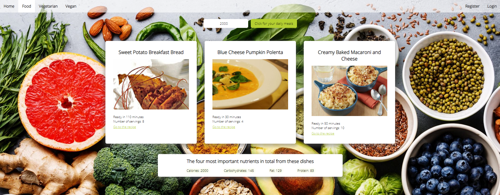

## App 'summer body'

### Inhoudsopgave

1. Inleiding
2. Probleem
3. API keys
4. De applicatie starten
5. Unit test

### 1. Inleiding

Deze frontend programming eindopdracht is gemaakt naar aanleiding van de Frontend Development opleiding aan NOVI Hogeschool.

Het project is opgezet met [Create React App](https://github.com/facebook/create-react-app).

### 2. Probleem

De zomer komt eraan en we willen allemaal een mooi, gezond lichaam op het strand, maar hoe doen we dit? Naast je in het zweet werken in de sportschool is goede voeding belangrijk. De juiste hoeveelheid calorieën elke dag innemen zorgt voor vermindering van vet en een goede conditie van het lichaam.

Deze app zorgt, nadat je de calorieën hebt ingevuld, met één druk op de knop voor drie maaltijden met de juiste hoeveelheid calorieën. Hoe je de maaltijden moet maken staat op een externe website waar naartoe is gelinkt.

### 3. API keys

De API keys gebruikt voor dit project komen van [Spoonacular](https://spoonacular.com/food-api/) en
[Firebase](https://firebase.google.com/firebase). Deze zullen in een apart bestand meegestuurd worden genaamd `.env`. Registreren kun je doen op de `register` pagina wanneer je de applicatie heb gestart.

### 4. De applicatie starten
Als je het project gekopieerd hebt naar jouw lokale machine, installeer je eerst de `node_modules` door de volgende commando's in de terminal te runnen:

- `npm install`
- `npm install axios`
- `npm install react-router-dom`
- `npm install firebase`

Wanneer dit klaar is, kun je de API keys van het `.env` bestand opslaan in de root van het project.

De applicatie starten doe je met behulp van:

`npm start`

Open http://localhost:3000 om de pagina in de browser te bekijken.

### 5. Unit test

Een unit test is in de map `src/__test__` te vinden en de runnen met:

`npm run test`